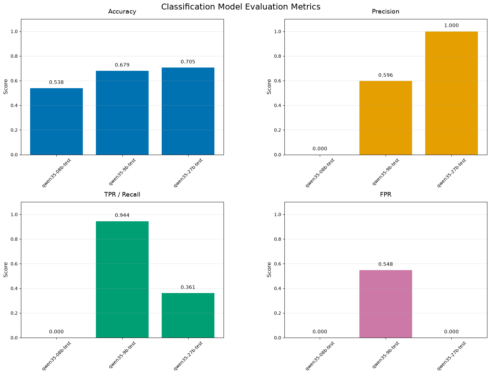

# Qwen 3.5 Model Family Results on EchoBot Guaridian Task
The graph below was produced by running the `evaluate_model()` function on three base Qwen 3.5 models (0.8B, 9B, 27B) using the v1 EchoBot training set (in the `./data/echobot_old/` directory).

> Quick Classification Metric Review
> 

> 
> - **Accuracy**: Fration of all predictions that are correct.
> 
> - **Precision**: Out of everything flagged (1), how many were actually supposed to be.
> 
> - **TPR (Recall)**: Of everything that should be flagged (1), how many were actually.
> 
> - **FPR**: Of everything that should not be flagged (0), how many were incorrectly flagged (1).
> 
> 

Firstly, as far as pure accuracy goes, the models exhibited an (expected) increase for this classification task as model parameters increase. The 0.8B model is as good as random guessing (well, it is actually worse than this as we'll see soon), the 9B model is a step up, and the 27B, though better than the 9B model, didn't offer much of an increase (only a one example difference).

The precision graph reveals that despite the close accuracy scores for the 9B and 27B models, they exhibit different patterns of classification. Of all the samples that the 9B model flagged as inappropriate, only about 60% actually were. On the other hand, every single example the 27B model flagged as inappropriate actually was.

The True Positive Rate (Recall) graph shows that of all samples that should have been flagged as inappropriate, the 9B model caught 94% of them while the 27B model only caught 36%. The False Positive Rate graph reveals that the 27B model never incorrectly flagged an appropriate query while the 9B model did so over 50% of the time. The 0.8B model scored a 0 on TPR, FPR, and precision, revealing that instead of randomly guessing, the model was always classifying queries as appropriate (0), no matter their content.