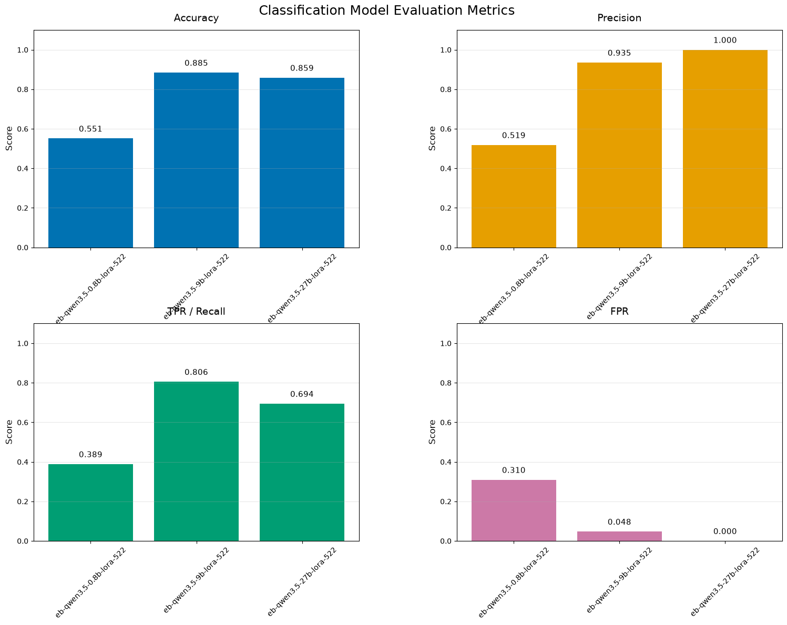

# Qwen 3.5 Model Family Results on EchoBot Guardian Task
The graphs below was produced by running the `evaluate_model()` function on three base Qwen 3.5 models (0.8B, 9B, 27B) using the v1 EchoBot training set (in the `./data/echobot_old/` directory). The fine-tuning parameters for this experiment can be found in the `configs/qwen3.5-0.8b-classifier-v1.yaml` file.

> Quick Classification Metric Review
> 

> 
> - **Accuracy**: Fration of all predictions that are correct.
> 
> - **Precision**: Out of everything flagged (1), how many were actually supposed to be.
> 
> - **TPR (Recall)**: Of everything that should be flagged (1), how many were actually.
> 
> - **FPR**: Of everything that should not be flagged (0), how many were incorrectly flagged (1).
> 
> 

## Base Model Performance

Firstly, as far as pure accuracy goes, the models exhibit an increase for this classification task as model parameters increase. The 0.8B model is as good as random guessing (well, it is not quite random as we'll soon see), the 9B model is a step up, and the 27B, though better than the 9B model, improves the accuracy by only 2 examples despite having 3 times the parameter count.

The precision graph reveals that despite the close accuracy scores for the 9B and 27B models, they exhibit different patterns of classification. Of all the samples that the 9B model flagged as inappropriate, only about 60% actually were. On the other hand, every single example the 27B model flagged as inappropriate actually was. But thist stellar score comes at the cost of TPR.

The True Positive Rate (Recall) graph shows that of all samples that should have been flagged as inappropriate, the 9B model caught 94% of them while the 27B model only caught 36%. The False Positive Rate graph reveals that the 27B model never incorrectly flagged an appropriate query while the 9B model did so over 50% of the time. The 0.8B model scored a 0 on TPR and FPR, revealing that instead of randomly guessing, the model was always classifying queries as appropriate (0), no matter their content thus achieving a majority-class baseline of 53.8% accuracy. This also means that since the 0.8B model makes no positive predictions, its precision is undefined (reported as 0).

From these results, we can see that the 0.8B model fails to perform this classification task, the 9B model is an aggressive classifier, and the 27B model is an extremely conservative classifier.

## Fine-Tuned Model Performance

The accuracy increased for all three models: 15.4 points for 27B, 20.6 for 9B, and a measly 0.13 for 0.8B.

For precision, the 27B model maintains its perfect score of 1, while the 9B model sites at a decent 0.935 score, a 0.339 increase from the base model. The 0.8B model shoots up to 0.519, showing that it is no longer always outputting '0' across all queries.

The 0.8B model achieved a positive TPR score and a valid FPR this time, however both metrics are significantly worse than the other two models tested.

TPR for the 9B model decreased by 0.138, showing that its increase in accuracy also stems from becoming less agressive of a classifier. Its FPR also tanked by a full 0.5, showing that the model made many fewer incorrect inappropriate classification. 

The 27B model's TPR almost doubled while also keeping its FPR at a flat 0: it increased the amount of queries it correctly flagged as inappropriate without becoming too aggressive and incorrectly flagging any appropriate queries.

Overall we can see that the fine-tuned 0.9B model is still the most aggressive classifier, but much less so than its base model. The 0.8B model seems to have learned the task, but performs poorly, indicating that 0.8B parameters may not be enough to capture the nuance of this natural language classification task. The 27B model has a slightly higher precision than the 9B model, but still at the cost of TPR. For this specific classification task (content filtering) we would prefer to use the 9B model to prevent inappropriate queries slipping through the filter at the cost of a couple appropriate queries being flagged. Plus the 9B model is much smaller, allowing for faster inference and lower hardware costs.
